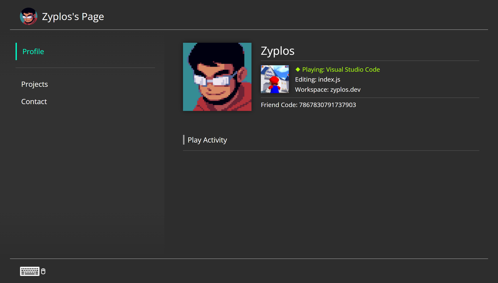

# switch-portfolio

An unfinished project that mocks the Switch UI. Originally meant to be a portfolio site for myself.

Made in Preact.



## Project Setup

```bash
# install dependencies
npm install

# serve with hot reload at localhost:8080
npm run dev

# build for production with minification
npm run build

# test the production build locally
npm run serve

# run tests with jest and enzyme
npm run test
```

For detailed explanation on how things work, checkout the [Preact CLI Readme](https://github.com/developit/preact-cli/blob/master/README.md).
